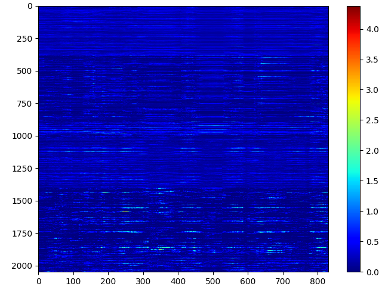
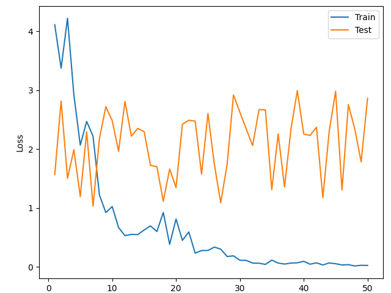
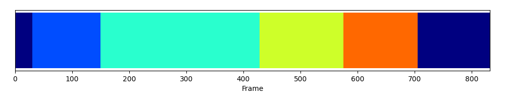
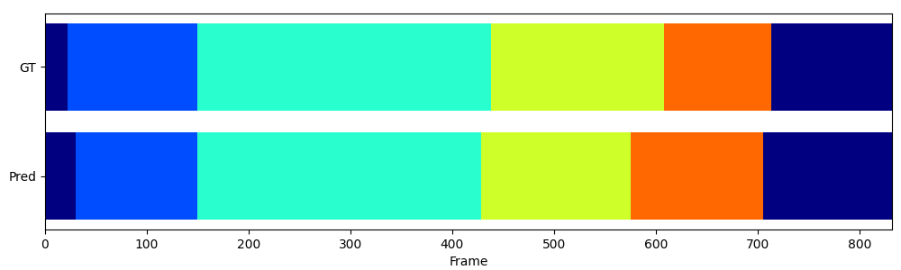
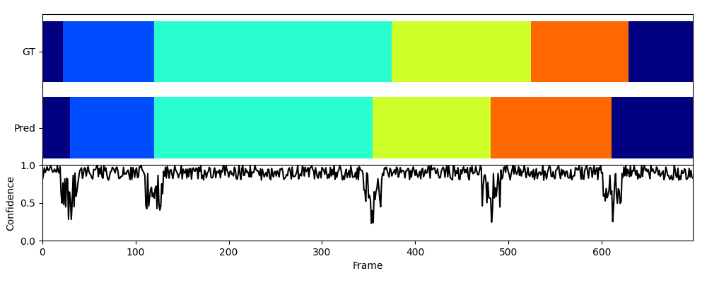

# Visualizer for Action Segmentation

This module provides the visualization tools for action segmentation.

## Features

- Plot feature maps

- Plot loss history

- Plot confidences

- Plot action segments bar for prediction

- Plot action segments bar for ground truth and prediction

- Plot action segments bar for ground truth, prediction, and confidences line

- Make video with action segments bar and labels

## Acknowledgements

This module contains Yota Yamamoto's code for making video. Thanks to Yota Yamamoto.
